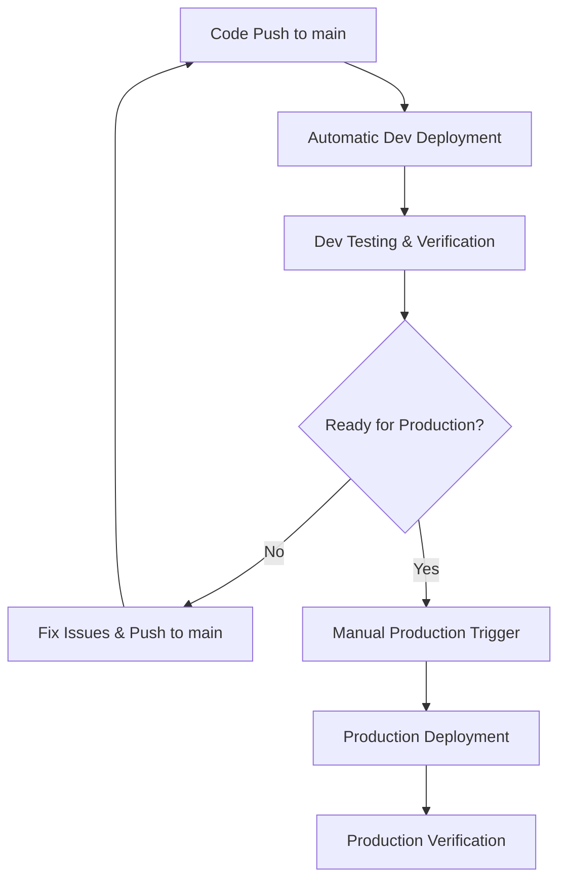

# 🚀 WhatsApp Web Service Deployment Guide

## Overview

This service uses a **dev-first deployment strategy** with **manual production approval** to ensure reliability and prevent direct production deployments.

## 🏗️ Deployment Architecture



## 🛡️ Safety Mechanisms

### ✅ What Happens Automatically

- **Dev Deployment**: Pushes to `main` branch automatically deploy to development
- **Testing**: All deployments run tests, linting, and build verification
- **Health Checks**: Automatic health verification after deployment

### 🚫 What Requires Manual Approval

- **Production Deployment**: Always requires explicit manual trigger with confirmation
- **Cross-Environment Promotion**: Cannot deploy to prod without dev validation

## 📋 Deployment Workflows

### 1. Development Deployment (Automatic)

**Trigger**: Push to `main` branch

```bash
# Push code to main branch
git checkout main
git add .
git commit -m "Your changes"
git push origin main
```

**What Happens:**

1. 🧪 Tests and linting run
2. 🏗️ TypeScript builds
3. 🐳 Container builds and pushes to dev registry
4. 🚀 Deploys to Cloud Run dev environment
5. 🔍 Health check verification

**Dev Environment:**

- Project: `whatzaidev`
- Service: `whatsapp-web-service-dev`
- Resources: 4Gi RAM, 2 CPU cores
- Min instances: 1 (no cold starts)

### 2. Production Deployment (Manual Only)

**Prerequisites:**

- ✅ Code must be tested in dev environment
- ✅ Dev health checks must pass
- ✅ Manual confirmation required

**Trigger**: GitHub Actions workflow dispatch

```bash
# Using GitHub CLI
gh workflow run deploy.yml \
  --field environment=prod \
  --field confirm_production=true
```

**Or via GitHub Web UI:**

1. Go to Actions tab
2. Select "🚀 Deploy WhatsApp Web Service"
3. Click "Run workflow"
4. Select:
   - Environment: `prod`
   - Confirmation: ✅ Check the box

**What Happens:**

1. 🔍 Pre-deployment verification of dev health
2. 🏗️ Production build with optimized settings
3. 🚀 Deploy to production Cloud Run
4. 🔍 Health check with retries
5. 📊 Deployment summary

**Production Environment:**

- Project: `whatzai-prod`
- Service: `whatsapp-web-service-prod`
- Resources: 8Gi RAM, 4 CPU cores
- Min instances: 2 (high availability)

## 🛠️ Manual Deployment Commands

### Quick Commands

```bash
# Check what you're about to deploy
npm run pre-deploy

# Deploy to dev
npm run deploy:dev

# Check dev health
npm run deploy:check-dev

# Check production health
npm run deploy:check-prod

# Attempt prod deployment (will show instructions)
npm run deploy:prod
```

### Advanced Cloud Build Commands

```bash
# Deploy to dev with custom substitutions
gcloud builds submit \
  --config cloudbuild-dev.yaml \
  --project whatzaidev \
  --region europe-central2 \
  --substitutions=_TAG=custom-tag

# Deploy to production (after manual approval)
gcloud builds submit \
  --config cloudbuild-prod.yaml \
  --project whatzai-prod \
  --region europe-central2
```

## 🔍 Health Monitoring

### Health Check Endpoints

- **Dev**: `https://whatsapp-web-service-dev-[hash].a.run.app/health`
- **Prod**: `https://whatsapp-web-service-prod-[hash].a.run.app/health`

### Health Check Response

```json
{
  "status": "healthy|degraded",
  "timestamp": "2024-01-15T10:30:00.000Z",
  "memory": {
    "rss": {
      "used": 1073741824,
      "containerLimit": 4294967296,
      "percentage": 25.0
    }
  },
  "websocket": {
    "healthy": 5,
    "failed": 0,
    "failureRate": 0
  },
  "instance": {
    "id": "instance-123",
    "isLeader": true,
    "sessionOwnership": 3
  }
}
```

## 🚨 Emergency Procedures

### Rollback Production

```bash
# Find previous working revision
gcloud run revisions list \
  --service=whatsapp-web-service-prod \
  --region=europe-central2 \
  --project=whatzai-prod

# Rollback to specific revision
gcloud run services update-traffic whatsapp-web-service-prod \
  --to-revisions=REVISION-NAME=100 \
  --region=europe-central2 \
  --project=whatzai-prod
```

### Scale Down in Emergency

```bash
# Scale production to 0 instances
gcloud run services update whatsapp-web-service-prod \
  --min-instances=0 \
  --max-instances=0 \
  --region=europe-central2 \
  --project=whatzai-prod
```

## 🎯 Best Practices

### Before Production Deployment

1. **Test in Dev**: Always verify functionality in dev environment
2. **Monitor Health**: Check `/health` endpoint shows `healthy` status
3. **Check Logs**: Review Cloud Run logs for errors
4. **Load Test**: Verify performance under expected load

### During Deployment

1. **Monitor Progress**: Watch deployment logs in real-time
2. **Verify Health**: Check health endpoints after deployment
3. **Test Critical Paths**: Verify WhatsApp connections work
4. **Monitor Metrics**: Watch memory, CPU, and connection metrics

### After Deployment

1. **Health Monitoring**: Set up alerts on health endpoint
2. **Log Monitoring**: Watch for errors in Cloud Logging
3. **Performance**: Monitor response times and memory usage
4. **User Testing**: Verify end-to-end functionality

## 📊 Deployment Environments

| Environment | Project        | Service Name                | Resources | Min Instances | Purpose              |
| ----------- | -------------- | --------------------------- | --------- | ------------- | -------------------- |
| Development | `whatzaidev`   | `whatsapp-web-service-dev`  | 4Gi/2CPU  | 1             | Testing & validation |
| Production  | `whatzai-prod` | `whatsapp-web-service-prod` | 8Gi/4CPU  | 2             | Live service         |

## 🔐 Security & Access

### Required Permissions

**Development:**

- Cloud Build Editor
- Cloud Run Developer
- Artifact Registry Writer

**Production:**

- Cloud Build Editor (whatzai-prod)
- Cloud Run Admin (whatzai-prod)
- Artifact Registry Writer (whatzai-prod)

### Secret Management

All secrets are managed through Google Cloud Secret Manager:

- `WHATSAPP_WEB_API_KEY`
- `BRIGHT_DATA_CUSTOMER_ID`
- `BRIGHT_DATA_ZONE_PASSWORD`
- `SESSION_ENCRYPTION_KEY`
- `WHATSAPP_WS_TOKEN`

## 📞 Support

If deployment fails:

1. **Check logs**: `gcloud builds log [BUILD_ID]`
2. **Verify health**: Use health check endpoints
3. **Review configuration**: Ensure Cloud Run settings are correct
4. **Monitor resources**: Check memory and CPU usage

For urgent issues, use emergency rollback procedures above.
